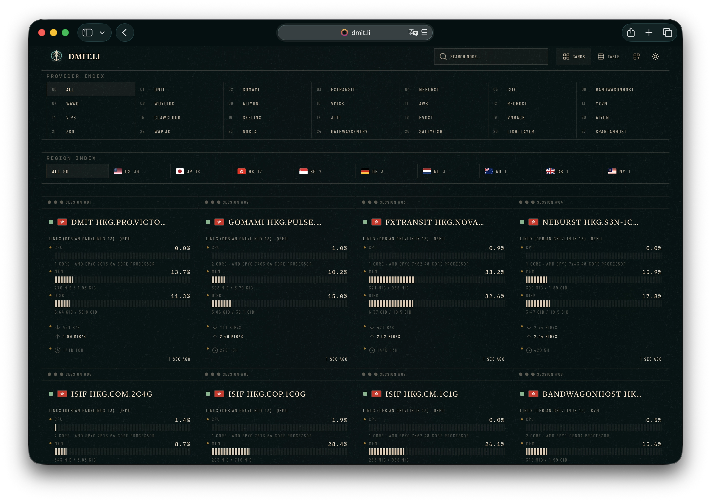
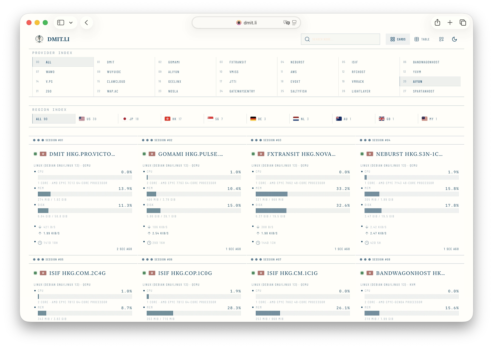

# Abyssal

一款为 NodeGet 设计的深海幽蓝主题。

| 深色模式 | 浅色模式 |
| :--: | :--: |
|  |  |

## 演示站

https://www.dmit.li

## 兼容性

适配 NodeGet StatusShow v1.4（当前 `1.4.3`）。主题以 overlay 方式套用在 StatusShow 上，StatusShow 大版本升级改动 DOM 结构时可能需要同步更新。

## 与 StatusShow 的区别

Abyssal 不改动 StatusShow 源码，**数据与监控功能与原版完全一致**，所有差异集中在 `public/custom.js` 与 `public/custom.css` 两个文件。在原版基础上提供：

- **深海幽蓝视觉**：自定义字体、多层背景纹理，卡片/表格/页眉页脚重排，适配明暗双模式。
- **国旗替代系统图标**：节点图标位直接展示地区国旗。
- **服务商（Provider）筛选**：从节点名归类服务商，提供一排快捷筛选。
- **分段式指标条**：CPU/内存/磁盘等进度条改为分段样式。
- **节点详情抽屉**：重新设计的详情面板，对表格与记录行重新排版。
- **延迟探针增强**：对 ping / tcp_ping 查询做缓存、合并、降采样，图例顺序确定化。
- **页脚与文案**：风格化排版，页脚显示主题版本与所配置的站点标题/图标。

## 安装

1. 在本仓库 GitHub Release 下载 `NodeGet-Abyssal-Theme.zip`。
2. 打开 NodeGet-Board 后台，进入 `Dashboard -> 主题管理`。
3. 点击「从本地上传」，选择下载的 ZIP。
4. 确认主题名称为 `NodeGet Abyssal Theme`，然后创建并上传。
5. 进入主题详情，在「主题配置（user_preferences）」填写站点标题、站点图标、页脚，并在「Token（site_tokens）」填写后端地址与访问 token。
6. 回到主题列表，打开 Abyssal 的「是否启用」开关。

启用后访问你的 NodeGet 后端根域名：

```text
https://你的后端域名/
```

未启用时可用静态路径预览（路径中的 `theme_Abyssal` 为上传时生成的 bucket 名，实际请以主题列表/详情页的预览链接为准）：

```text
https://你的后端域名/nodeget/static/theme_Abyssal/index.html
```

## 更新

1. 下载新版 `NodeGet-Abyssal-Theme.zip`。
2. 在主题列表中找到 Abyssal。
3. 选择「从本地重新上传」并上传新版 ZIP。

更新时建议保留旧的 `site_tokens` 和用户配置，避免覆盖你自己的后端 token。

## 从源码构建

发布包由 StatusShow 构建产物叠加本仓库的 `public/`（`custom.js`、`custom.css`、资源）与 `nodeget-theme.json` 生成。自行打包步骤：

1. 将 StatusShow 源码克隆为本仓库的同级目录 `../statusshow`：

   ```bash
   git clone https://github.com/NodeSeekDev/NodeGet-StatusShow ../statusshow
   ```

2. 在 StatusShow 目录安装依赖（打包会复用其 Vite 工具链）：

   ```bash
   (cd ../statusshow && npm install)
   ```

3. 回到本仓库执行打包，产物为 `dist/` 与 `dist/NodeGet-Abyssal-Theme.zip`：

   ```bash
   npm run build:release
   ```

可选：`npm run verify:package` 校验产物结构；如需重新生成背景纹理资源，执行 `npm install && npm run build:assets`（依赖 `sharp`）。

## 许可证

AGPL-3.0-only。详见 [LICENSE](LICENSE)。

## 鸣谢

本主题基于 [NodeGet StatusShow](https://github.com/NodeSeekDev/NodeGet-StatusShow) 开发。
